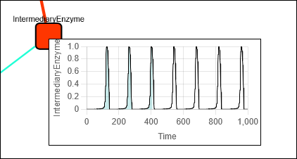

# Instruction of visualization tool

## Overview
  

- This example is [here](./examples/BIOMD0000000007).
- You can visualize it by opening the html file in your web browser.
- You can share visualizations with collaborators by sending them the HTML file along with the timecourse.js and diagram.js files.

## Usage
### Control Panel
  

- Use the control panel to adjust the network layout, display edge labels, handle time course values, change colors, control animation, and save layouts.

### Network Layout
  

- Choose from 9 different network layout algorithms (see [here](https://blog.js.cytoscape.org/2020/05/11/layouts/)). Selecting an algorithm will automatically reposition the nodes.
- You can also manually move nodes by dragging and dropping them.

### Display Edge Labels (Flux Equation)
- To display an edge's label, select the edge.

- To display all edge labels, check the "Eq." checkbox.

### Display Line Plot for Node Time Course Data
- To view a line plot of a node's data, select the node.
  

### Switch Between Normalized and Relative Values for Node/Edge Display
- Toggle between displaying normalized values for a single node (or edge) and relative values between nodes (or edges).
- This allows you to compare the relative impact of nodes and edges within the network.

### Change Color Palette
  

### Play Node and Edge Animation
- Start the animation using the "Play" button and stop it with the "Pause" button.
- Select a specific time state by clicking on the progress bar.

  

- Adjust the animation speed using the speed selector.
  

- The color and size of nodes and edges correspond to their values in the time course data. (Higher values result in larger sizes.)
- By default, normalized values are used for both color and size.
- Checking the "Rel." checkbox will switch to using relative values among nodes and edges for their color and size.

### Save Layout After Moving Nodes
- You can save your customized network layout using the "Save layout" button.
- Note: Due to web browser security, the downloaded file will be saved as a .txt file by default, and you may need to select "save as" from your browser's download options.

  

- When saving, ensure you select "All files (.)" as the file type.
  

- Rename diagram.txt to diagram.js.
- Overwrite the existing diagram.js file in your current model's directory.

- This ensures that the network will open with your saved layout the next time you access the file.

### Minimize Control Panel
- Hide the control panel using the "Hide" button and display it again with the "Show" button.

- Animation will continue to play even when the control panel is minimized.

## References
- [Cytoscape.js](https://github.com/cytoscape/cytoscape.js)
