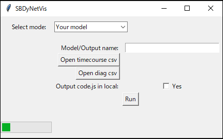
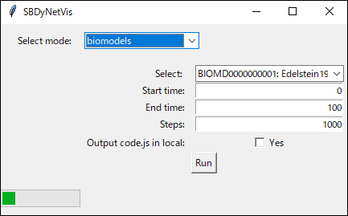

# Dynamic Network Visualization Tool for Systems Biology Models

## Published Paper/Citation
Kentaro Inoue, SBDyNetVis: a visualization tool of dynamic network for systems biology model, BioSystems 258, 105644, 2025.


## Features
- __Dynamic Visualization__: Node and edge colors and sizes change over time based on their values.
- __Edge Labels__: Display all or specific edge labels (flux equations) within the network.
- __Node Line Plots__: View a line plot of selected node data directly next to the node.
- __Switchable Assignment__: Colors can be determined by normalized values (0-1) for individual nodes and edges, or by relative values between nodes or edges at a given time.
- __Quick Start with BioModels__: Easily visualize models from BioModels. Networks are automatically reconstructed from schemes converted by [basico](https://github.com/copasi/basico).
- __Layout Options__: Choose from 9 layout algorithms and save custom node positions.
- __Standalone GUI__: Use SBDyNetVis as a standalone GUI application without writing any code. See [GUI application](#Standalone-GUI-Application) for details.
- For detailed instructions on using the visualization tool, refer to the  [Instruction](./Instruction.md) file.

## Installation
Tested version: Python 3.11  
Recommendation: Use a virtual environment (e.g., venv).  
Windows:
```bash
python -m venv venv
.\venv\Scripts\activate
```
Mac/Linux:
```bash
python -m venv venv
source ./venv/bin/activate
```
Install SBDyNetVis using pip:
```bash
pip install git+https://github.com/kntrinoue/SBDyNetVis.git
```

## Usage
### Quick Start
Visualize a dynamic network using a model from BioModels:
```python
from SBDyNetVis.biomodels2dynet import *

biomodels2dynet("BIOMD0000000001", start_time=0, end_time=1000, steps=1000, localCode=False)
```
- biomodels2dynet(modelid, start_time, end_time, steps, localCode) Parameters:
  - modelid: model id in BioModels. Model id list which can use in SBDyNetVis is in [here](./SBDyNetVis/confirmed_list_biomodels.json).
  - start_time: start time in simulation. Default value is 0.
  - end_time: end time in simulation. Default value is 1000.
  - steps: step size from the start time to the end time in simulation. Default value is 1000.
  - localCode: output a javascript code for visualization to your directory. Default value is False. If False, the code is called from an external file.
- Simulation is performed by [basico](https://github.com/copasi/basico).  
  -  Note: basico may occasionally encounter internet errors. Retrying after a few minutes often resolves the issue.
 
Upon successful execution, an output directory named (modelid) will be created in your current directory, containing the following files:
```
|-(modelid)
     |-(modeid).html
     |-(modeid)_timecourse.csv
     |-(modeid)_diagram.csv
     |-timecourse.js
     |-diagram.js
     |-code.js (if localCode=True)
```
- Once the directory is created, you can visualize the model by opening the (modelid).html file in your web browser, no further Python execution is needed.

Mac OS SSL Errors: If you encounter SSL errors on Mac OS, installing the following may resolve the problem:
```bash
pip install pip-system-certs
```

### Visualize Your Data 
- To visualize your own data, you need to prepare two CSV files: timecourse.csv and diagram.csv. Examples are provided below.

#### timecourse.csv (Time Course Data Format)
```
Time, s1, s2, v1, v2
0, 0, 0, 0, 0
1, 0.1, 0.1, 0.3, 0.5
2, 1, 2, 1, 1
```
*The first header column must be "Time". Subsequent header columns should be species and reaction names corresponding to your time course data.
*The second and subsequent rows contain numeric data.
*Numeric values are converted to 3 digits, as color types are limited to 256 colors.

#### diagram.csv (Diagram Data Format)
```
tcID, reactant, product, type, label
v1, s1, s2, ->, k0*s1-k1*s2
v2, s2, v2_mod, ->, k2*s4*s2 
s4, s4, v2_mod, -o, k2*s4*s2
v2, v2_mod, s3, ->, k2*s4*s2
v3, s3, v3_mod, ->, k3*s3/s5 
s5, s5, v3_mod, -|, k3*s3/s5
v3, v3_mod, s6, ->, k3*s3/s5
v4, s6_src, s6, ->, k4
v5, s6, s6_deg, ->, k5*s6
```
*The header columns are fixed as shown above.
##### type in Diagram Data Format (Edge Types)
- ->: Reaction. A positive value in the tcID time course results in a target arrow, while a negative value results in a source arrow.
- -o: Modification, activation.
- -|: Inhibition.  

##### reactant and product in Diagram Data Format (Node Names)
- xxx: Species node (round-rectangle shape).
- xxx_mod: Modification node (rectangle shape, name not shown in network).
- xxx_deg: Degradation node (round-triangle shape).
- xxx_src: Source node (round-tag shape).


Node type is identified by its suffix.  

##### Relationship between timecourse.csv and diagram.csv
- Names in tcID, reactant, and product in the diagram data should correspond to names in the time course data. 
- If a name in the diagram data does not exist in the time course data, the corresponding node or edge's color and size will not change in the network.

#### Execute with Your Model
If you haven't installed pandas, install it first:  
```
pip install pandas
```
Then, create and execute a Python script like this:
```python
from SBDyNetVis.make_dynet import *
import pandas as pd

timecourse_data = pd.read_csv("timecourse.csv")
diagram_data = pd.read_csv("diagram.csv")
dynet = MakeDyNet(timecourse_data, diagram_data, modelName='result', localCode=False)
dynet.run(show=True)
```
- MakeDyNet(timecourse_data, diagram_data, modelName, localCode)
  - Paramters:
    - timecourse_data: A pandas DataFrame in the timecourse.csv format.
    - diagram_data: A pandas DataFrame in the diagram.csv format.
    - modelName: The output directory/file name. Default: 'result'.
    - localCode: If True, the main script file code.js is created in the modelName directory. If False (default), the HTML reads the file from GitHub. Set to True if you wish to modify code.js and use your customized application.
  - Returns: A MakeDyNet class instance.
- run method in MakeDyNet class (dynet.run(show)):
  - show: If True, the visualization will open in your web browser immediately. If False, only the directory and files for visualization will be created. You can then open the HTML file manually to view the network.
 
Upon execution, an output directory named (modelName) will be created, containing:
```
|-(modelName)
     |-(modelName).html
     |-timecourse.js
     |-diagram.js
     |-code.js (if localCode=True)
```
---------------
#### GUI Application as Python Library
```python
from SBDyNetVis.sbdynetvis_gui import *

app = SBDyNetVisGUI()
app.mainloop()
```
- The usage of this GUI application is identical to the [Standalone GUI Application](#Standalone-GUI-Application).

### Standalone GUI Application
You can download standalone GUI applications for SBDyNetVis (tested on the following OS versions):
- [Windows](https://www.cc.miyazaki-u.ac.jp/cblab/SBDyNetVis/sbdynetvis_gui_win.zip) (Windows 10/11)
- [Mac](https://www.cc.miyazaki-u.ac.jp/cblab/SBDyNetVis/sbdynetvis_gui_mac.zip) (macOS 12.7.6)
- [Linux](https://www.cc.miyazaki-u.ac.jp/cblab/SBDyNetVis/sbdynetvis_gui_linux.zip)  (Ubuntu 22.04.5 LTS)

Unzip the downloaded file, then execute SBDyNetVis (e.g., by double-clicking the file).

- You can select a mode: "your model" or "biomodels". 
  - your model
    -  Input your CSV files and click "Run".
  

  - biomodels
    -  Select a listed model for BioModels and click "Run".
    


*Startup time: Approximately 20 seconds. Please be patient.

## Others
-  Modification, source, and degradation nodes do not change in the network.
- If you experience issues with zoom in/out, try setting localCode=True. Then, modify the wheelSensitivity value (range: 0-1, default: 0.1) on line 37 of code.js to a suitable value for your needs.

## Release Note
- 2025.07.31:  Initial release!

## References
- [Cytoscape.js](https://github.com/cytoscape/cytoscape.js)
- [js-colormap](https://github.com/timothygebhard/js-colormaps/blob/master/js-colormaps.js)
- [basico](https://github.com/copasi/basico)

## License
[MIT](./LICENSE)

------
(c) Kentaro Inoue, University of Miyazaki
